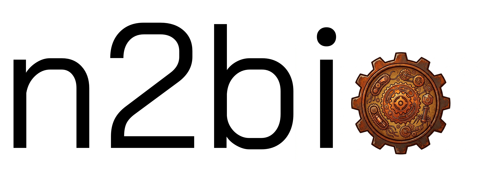

<div align="center">
    
</div>

## n2bio v0.1.1 - a rust workspace and library for building bioinformatics cli tools

*I created this repo as part of my rust learning journey - building cli tools that I use in my own research & using LLM's along the way.*

This crate is still under active development. It is expected that new features will be added regularly.

Version 0.1.0 is available at crates.io

**Install**
Run the following Cargo command in your project directory:

```cargo add n2bio```

Or add the following line to your Cargo.toml:

```n2bio = "0.1.0"```


**Modules I'm developing to work with standard file formats, IO, and common bioinformatics data.**
  - sam.rs      - Read and work with SAM formatted alignment records.
  - bam.rs      - Read and work with BAM formatted alignment records.
  - fastq.rs    - Read and write fastq files.
  - fasta.rs    - Read and write fasta files.
  - sequence.rs - Traits to work with DNA sequence data.
  - kmer.rs     - Traits to work with kmers.
  - hist.rs     - Structs and functions to work with distributions and associated stats.
  - metadata.rs - Structs and functions to work with common metadata files (tsv, json, jsonl).
  - readers.rs  - Boilerplate code for reading files and stdin.
  - writers.rs  - Boilerplate code for writing data to files and stdout.